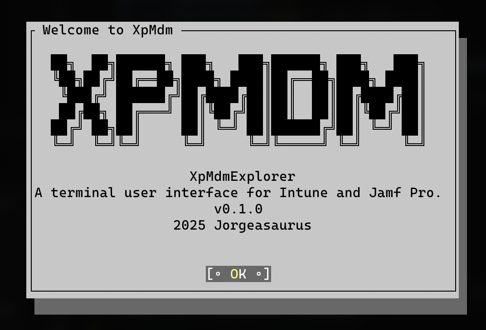

# XpMdmExplorer 🌐
**XpMdmExplorer** is a terminal-based, cross-platform Text User Interface (TUI) for exploring and managing devices, apps, and users in both Microsoft Intune and Jamf Pro. 🚀



## 🖼️ Demo


# Table of Contents
- [🚀 Overview](#-overview)
- [✨ Features](#-features)
- [🛠️ Prerequisites](#️-prerequisites)
- [⚙️ Installation & Setup](#️-installation--setup)
- [🎮 Usage](#️-usage)
- [📂 Supported Objects & Categories](#️-supported-objects--categories)
- [🖼️ Screenshots & Demo](#️-screenshots--demo)
- [📝 Logging](#️-logging)
- [🤝 Contributing](#️-contributing)
- [📜 License](#️-license)

## 🚀 Overview
XpMdmExplorer provides an interactive UI for browsing Microsoft Graph (Intune) and Jamf Pro APIs without leaving your terminal. Navigate categories, subcategories, and items, view detailed JSON output, and export data with ease. 💡

## ✨ Features
- Intune & Jamf Pro integration via Microsoft Graph SDK and Jamf API 🔗
- Category → Subcategory → Items navigation flow 📋
- Dynamic table view of items 📊
- Built-in UI themes: choose from light, dark, and custom color schemes 🌈
- Detail pane showing full JSON of selected item 🔍
- Export selected item to JSON file 💾
- Status bar for connection state, source URIs, and version info 📍
- Command mappings and paging support for large data sets 📑
- Cross-platform (Windows, macOS, Linux) via PowerShell 7+ 🖥️

## 🛠️ Prerequisites
- PowerShell 7.0 or higher
- .NET Core Runtime (included with PowerShell 7+)
- Microsoft Graph PowerShell SDK (`Install-Module Microsoft.Graph`)
- Terminal.Gui and NStack assemblies (bundled in `Resources/Assemblies`)
- Jamf Pro account with API access (Base URL, Username/Password)

## ⚙️ Installation & Setup
1. **Clone the repository**
   ```bash
   git clone https://github.com/jorgeasaurus/XpMdmExplorer.git
   cd XpMdmExplorer
   ```

2. **Install PowerShell dependencies**
   ```powershell
   Install-Module Microsoft.Graph -Scope CurrentUser -Force
   ```

3. **Configure Jamf Pro**
   Edit `Functions/Jamf/config.ps1` and update:
   ```powershell
   $Config = @{
     BaseUrl      = 'https://your-jamf-server.com'
     Username     = 'api_user'
     Password     = 'your_password'
   }
   ```

4. **Import the module**
   ```powershell
   Import-Module .\XpMdmExplorer.psm1
   ```

## 🎮 Usage
1. **Launch the UI**
   ```powershell
   XpMdmExplorer
   ```

2. **Connect to Microsoft Graph** 📡
   - Use the `Intune` menu > **Connect** to authenticate against your tenant.
   - After successful connection, your connection status and Tenant appear in the status bar.

3. **Connect to Jamf Pro** 🐘
   - Use the `Jamf` menu > **Connect** to enter your Jamf credentials and obtain an API token.
   - Status bar updates on successful connection.

4. **Navigate the UI**
   - Left pane: select an MDM category (Intune or Jamf).
   - Middle pane: choose a subcategory.
   - Right-upper pane: item table view.
   - Right-lower pane: JSON details for the selected item.

5. **Export** 🔄
   - Click the **Export** button to save the current item as a JSON file.

## 📂 Supported Objects & Categories
### Microsoft Intune
- **Home:** Device Compliance summary, APNs Certificates, Managed Device Overview
- **Devices:** Managed Devices, Configurations, Compliance, Scripts, Settings, Categories, Filters, Conditional Access
- **Apps:** Mobile Apps, Configs, Managed App Configs, Protection Policies, Categories, Discovered Apps
- **Users:** Directory users, Audit Logs, Sign-in Logs
- **Groups:** Active & Deleted Groups
- **Reports:** Compliance, install summaries, non-compliance, custom Graph reports

### Jamf Pro
- **Computers:** Inventory, Policies, Config Profiles, Groups, Scripts, Extension Attributes, Packages
- **Mobile Devices:** Device inventory, Apps, Config Profiles, Extension Attributes
- **Jamf Users:** Users & Groups
- **Accounts:** Raw account endpoints (users & groups wrapper)
- **Settings:** Buildings, Departments, Categories

## 📝 Logging
- Logs are written to `Logs/XpMdmExplorer.log` by default.

## 🤝 Contributing
- Contributions are welcome and appreciated 👍
- Fork the repo and create feature branches ✨
- Submit pull requests with detailed descriptions 📝

## 🚧 Roadmap & Future Ideas
Here are some ideas and planned features for future releases:
- [ ] 🔍 Live search and filter within tables
- [ ] ⌨️ Standalone cmdlets for commandline use
- [ ] 📂 Bulk export of multiple items or entire tables (CSV/JSON)
- [ ] ✏️ Edit and update Intune or Jamf objects directly from the TUI
- [ ] 📊 Graphical charts and dashboards for key metrics
- [ ] 🧪 Unit and integration tests for TUI components
- [ ] 🚀 Performance optimizations for very large data sets
- [ ] 🌐 Support for additional connectors (e.g., Workspace ONE, SCCM)
- [ ] 🎓 Interactive guided tutorials and help overlays

## 📜 License
This project is licensed under the MIT License. See [LICENSE](LICENSE) for details.

## 🙏 Acknowledgements

Special thanks to:
- **@merill** for the encouragement he gave on a simpler version of this tool.
- **@jdhitsolutions** for this session at PSConfEU [Getting started with PowerShell TUIs](https://youtu.be/FOuw3mSZFnU); It was a great resource for getting into the PS TUIs.
- **@adamdriscoll** for this deep dive blog post [The Ultimate Guide to Terminal User Interfaces in PowerShell](https://blog.ironmansoftware.com/tui-powershell). 

- The broader PowerShell and security communities for their contributions, discussions, and creativity.
